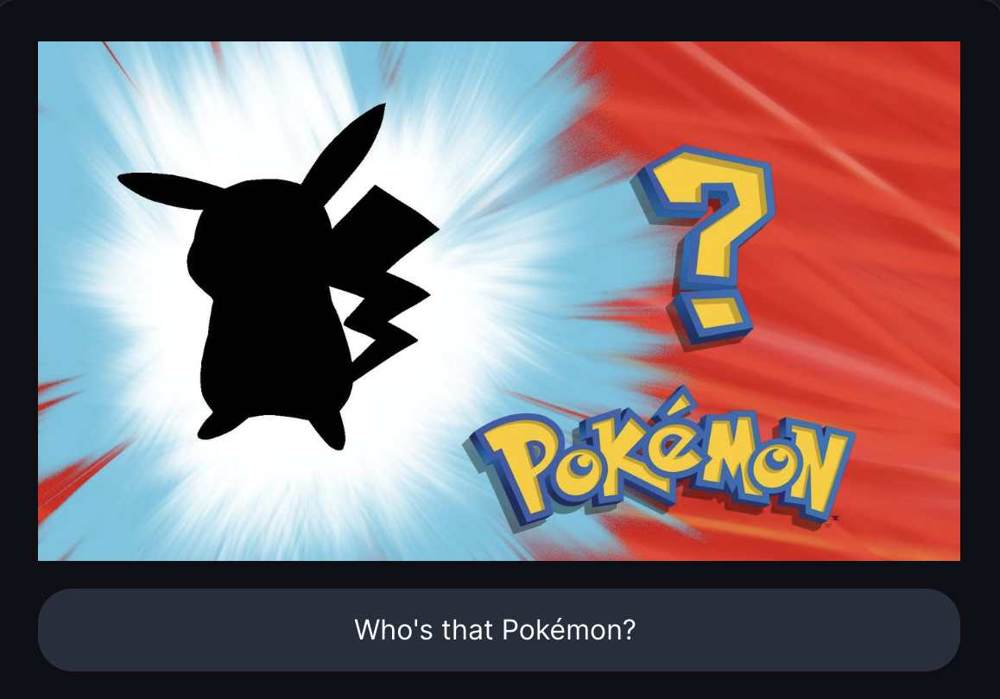
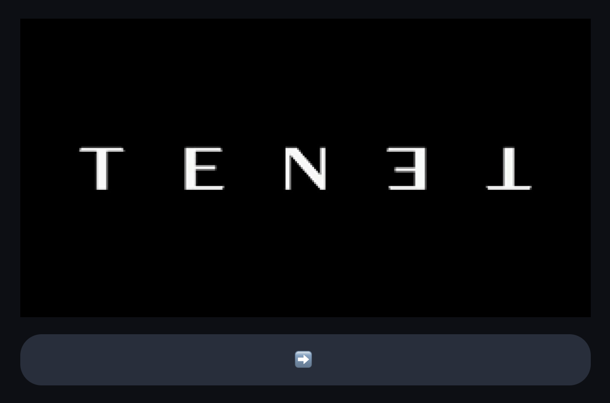
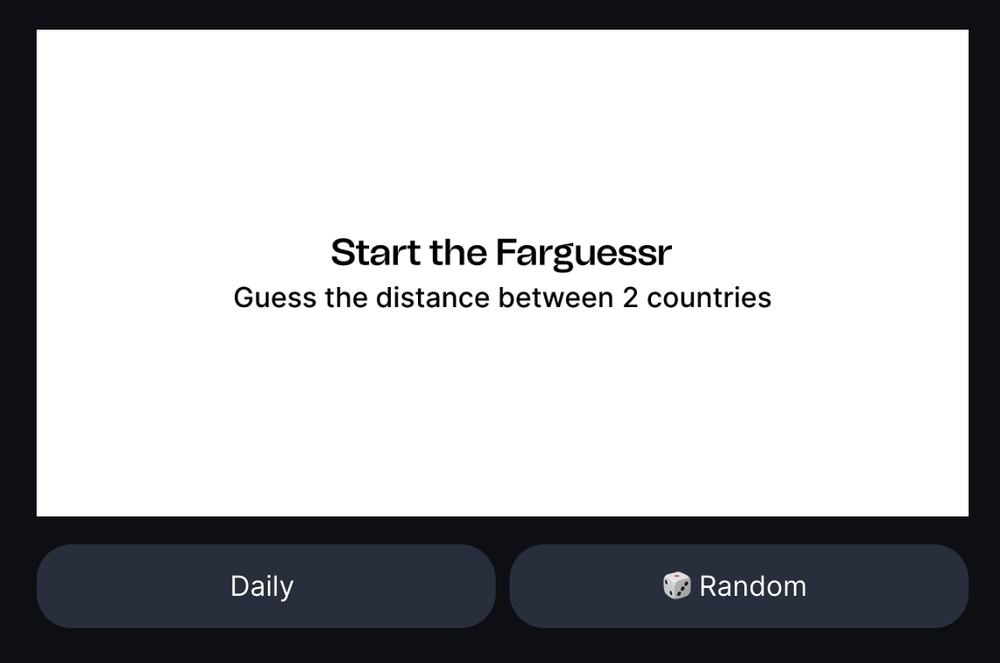
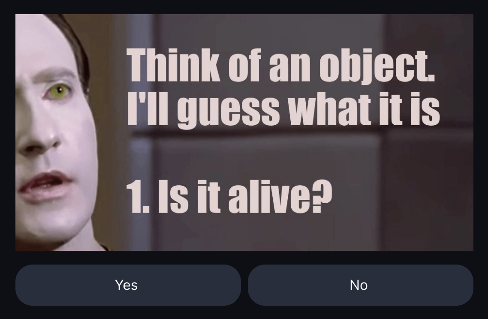
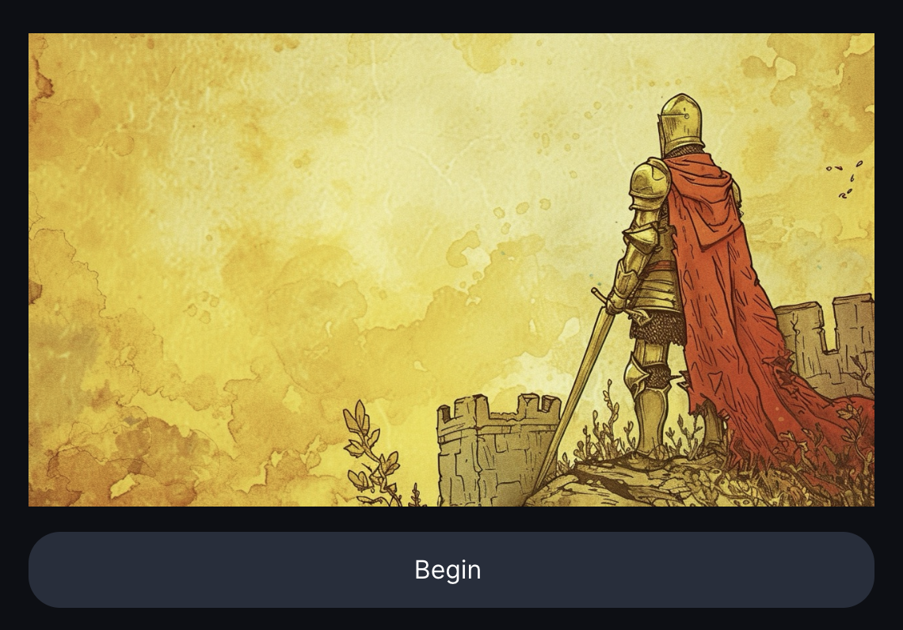
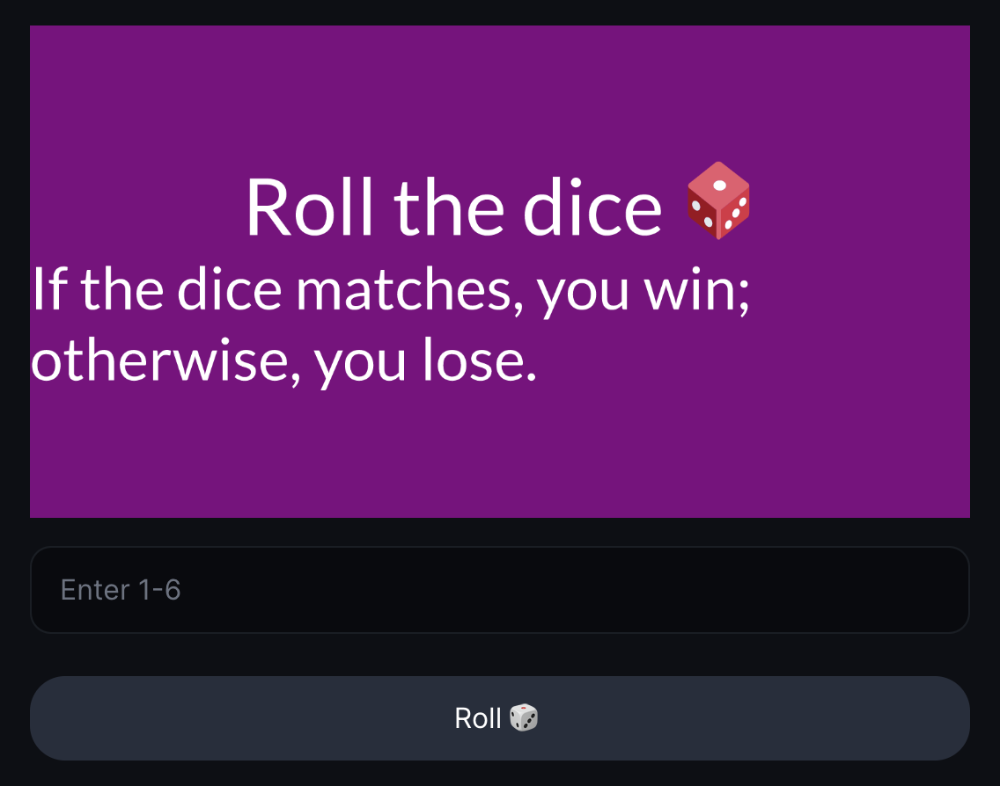
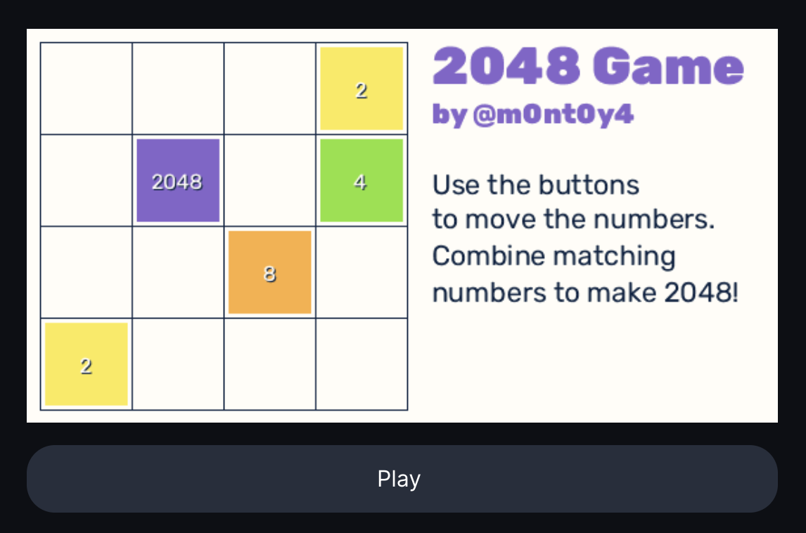
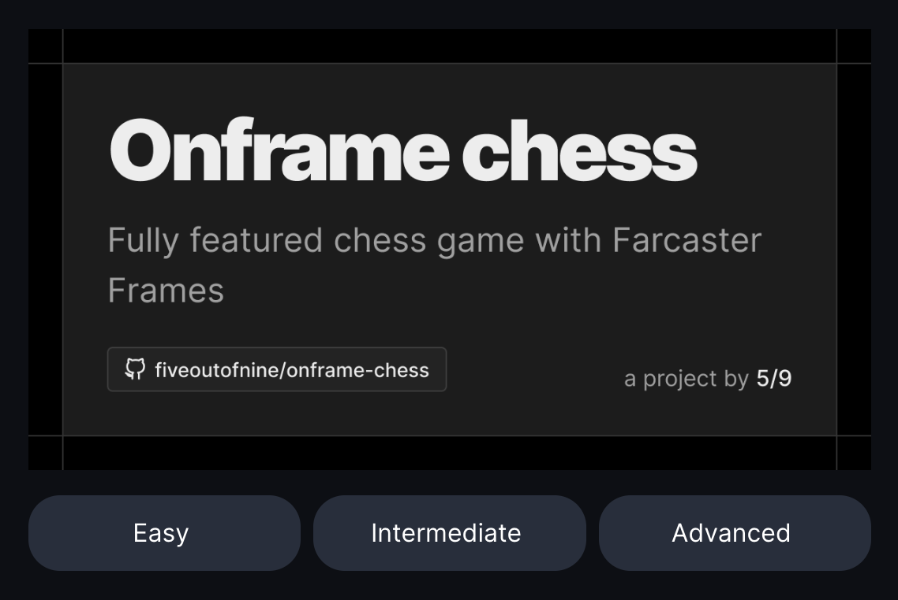

# How To Post A Frame

1. Click the “+” button in the top right corner of your screen to create a new post.
2. In the dropdown menu at the top of the post editor, choose which Portal you would like to post your Frame to (you can explore Portals [here](https://dscvr.one/explore/portals/featured)), or keep the default selection to post to your own Profile.
3. Paste your Frame URL into the post editor and your Frame will appear below it. 
4. Add any other text, media, or memes you’d like to have in your Frame post. 
5. Click Post, and admire your awesome new DSCVR post featuring a Frame. 🖼️

## Examples You Can Post Now!

- **Who’s that Pokemon?** 
    Frame Url: https://pokeframe.joepetrich.com/  
    Source: https://warpcast.com/jpetrich
     
- **Full Movie: Tenet** 
    Frame Url: https://tenet-onframe.vercel.app/ 
    Source: https://warpcast.com/shahruz 
     
- **Guess the distance between 2 countries** 
    Frame Url: https://farguessr.vercel.app/ 
    Source: https://github.com/cryptods8/farguessr
     
- **AI Trivia - 20 Questions Game** 
    Frame Url: https://ai-trivia-frame.netlify.app/ 
    Source: https://github.com/Tech-axis/ai-trivia
     
- **Choose Your Own Adventure** 
    Frame Url: https://far-chi.vercel.app/ 
    Source: https://github.com/Vamsieth/farcast
     
- **Roll-the-dice Game** 
    Frame Url: https://xmtp-frames.vercel.app/ 
    Source: https://github.com/LeoFranklin015/XMTP-frames
     
- **2048** 
    Frame Url: https://homerow.club/2048/ 
    Source: https://warpcast.com/m0nt0y4
     
- **Onframe Chess** 
    Frame Url: https://onframe-chess.vercel.app/play 
    Source: https://github.com/fiveoutofnine/fiveoutofnine-chess
     